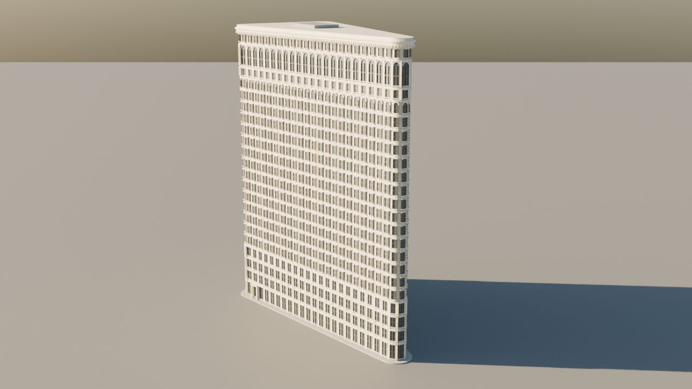

# Photo-guided Flatiron in Blender

An editable architectural approximation built with GPT-6 Astra, Codex and live Blender MCP. Includes the accepted scene and the successful construction steps. No hidden 3D generation endpoint or photogrammetry solver was used.

## Things to try

1. Open `assets/flatiron_accepted.blend` in Blender 5.2.1 and orbit the model.
2. Replay the successful construction in a fresh Blender GUI scene with `scripts/rebuild.py`.
3. Adjust the dimensions and facade parameters in `scripts/flatiron_base.py`, then replay.
4. Use the prompts below with your own photos and compare rendered views after each revision.
5. Read the [token receipt](docs/token-receipt.md) before quoting the cost.

## Replay

In Blender's Scripting workspace, open `scripts/rebuild.py` and run it. It clears the active scene, so use a new file. The script writes the rebuilt scene and two previews under `outputs/rebuild/`. Tested baseline: Blender 5.2.1 LTS on macOS, live GUI. Headless rendering crashed on the original Mac; a live GUI process worked.

The replay is deterministic procedural Python captured from the successful MCP calls. It does not rerun a language model or guarantee what a fresh model session will produce. The accepted `.blend` is the comparison control.

## Agent workflow

Install [Blender MCP](https://github.com/ahujasid/blender-mcp) following its upstream instructions. Use a disposable Blender scene. Give the agent photos plus: “Inspect the scene. Build an approximate massing and facade model. Preserve editable geometry. Inspect overview and close-up renders, revise visible defects, save the scene, and document guessed dimensions.”

Ask for one visible revision at a time. The render camera and interactive viewport are separate: moving `scene.camera` does not necessarily change `get_viewport_screenshot`. Inspect the actual output.

## Scope and limits

Rounded triangular footprint, 22 facade intervals, repetitive windows, facade relief and cornice. Nominal 87 m height and 80 × 32 m unrounded footprint were rough prior-knowledge estimates, not photo measurements. Ornamental sculpture is simplified. This is a visual approximation, not a measured digital twin.

The original successful pass used Astra medium. Claude Sonnet 5 supervised the wider experiment; local Qwen3-Coder 30B supported separate research. See the receipt for boundaries and failed attempts.

## Credits and reuse

Code: MIT. Generated model: CC BY-SA 4.0. Photo-derived presentation media: CC BY-SA 4.0. [Reference photo credits](docs/photo-credits.md). No private session logs or FSLA production assets are included.

## Verification

A fresh Blender GUI replay completed and matched every accepted mesh vertex, polygon and material assignment across all 12 meshes. Workbench preview pixels differ with display defaults; geometric equality is not pixel-identical rendering. The lit preview is a later presentation candidate, not the original accepted Workbench image.

The distributed scene has local render/image paths sanitized; the private archived original is retained separately. Tabletop USDZ import was checked in Blender at approximately 0.403 × 0.850 × 1.014 metres including roof and sidewalk. Native headset appearance remains unverified.

## Portable material candidate

This branch contains an artistic PBR refinement that preserves the accepted vertex and face data. Run `scripts/material_candidate.py` in Blender 5.2.1 to create the candidate under `outputs/`: six 512-pixel seamless limestone/terracotta base-color, roughness and tangent-normal maps, a source `.blend`, and a self-contained tabletop USDZ. Maps are synthesized from seeded mineral noise, not photographic scans or measured material data. Base color uses sRGB; roughness and normals use raw data.

`verify_material_import.py` checks the packaged candidate against the bundled baseline. Both import with 11 meshes, 285,662 vertices, 186,699 faces and dimensions approximately 0.403 × 0.850 × 1.014 m. The ground plane is excluded in both exports. Apple `usdchecker` and `usdchecker --arkit` pass. `compare_materials.py` renders both imported packages with matching daylight, overview and detail cameras in a disposable GUI process.

The stone repeat is 4 m in source scale, or 4/87 m on the tabletop. Face-projected UVs preserve topology but are not a hand-unwrapped asset; subtle seams may be visible on close inspection. Glazing is opaque and reflective because the accepted closed shell contains no interiors. Blender clearcoat settings are not guaranteed to translate to USD Preview Surface. No photo-calibrated reconstruction or headset visual acceptance is claimed.
